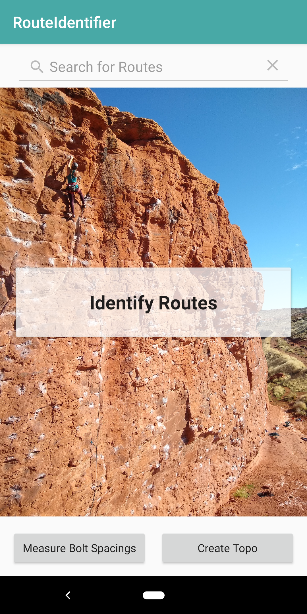
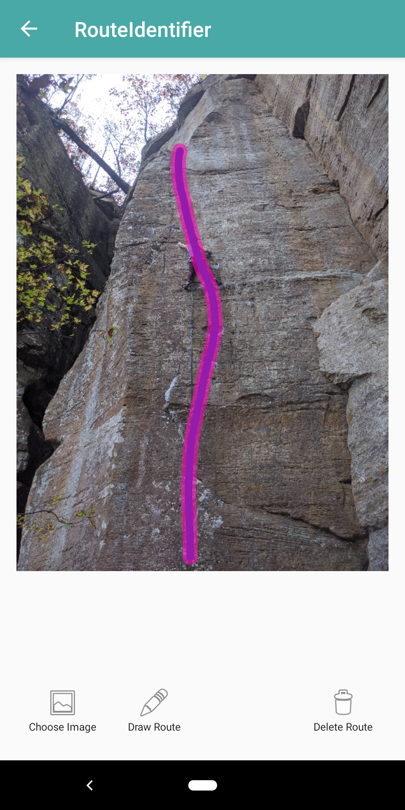
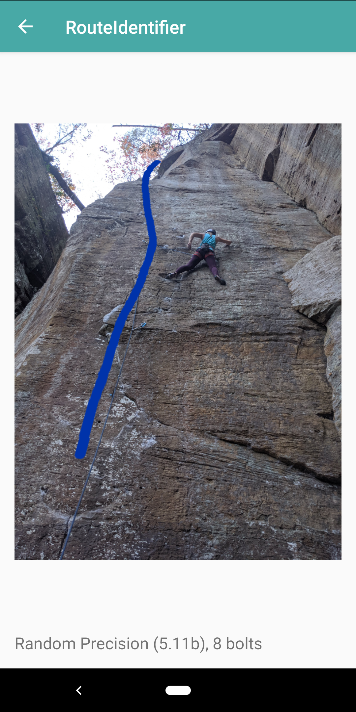
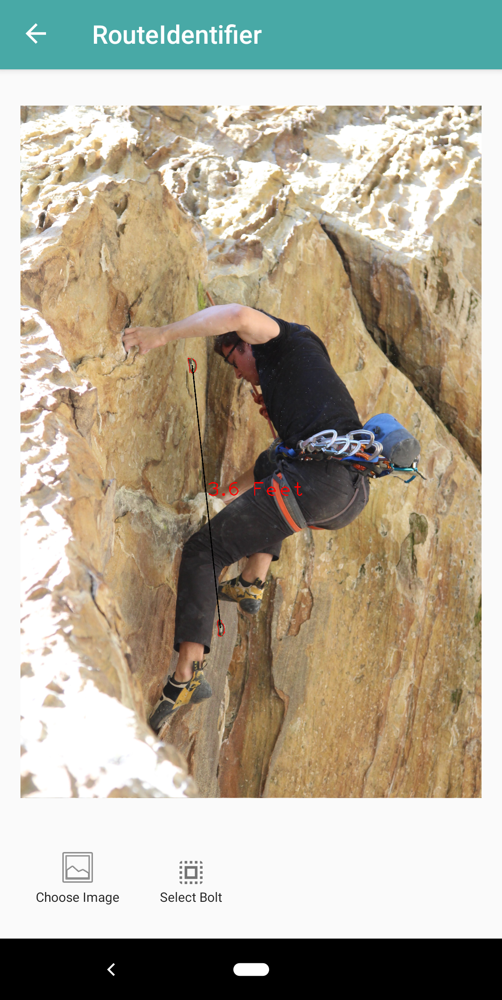

# RouteIdentifier

Android mobile app created as part of Fall 2019 Independent Work project. The goal was to provide a novel way of finding rock climbing routes using computer vision.

## App Features

### Add a Route to the Database
Upload a photo of a rock climbing route and draw the route's location. Submit the route information and photo to the database. Now the app can use that photo to identify the same route in other user images.

### Identify a Route from a Photo
Take a photo of a rock climbing route. The app will try to identify the location of the route in the image using feature matching to compare it to photos in the database.

 
 ### Estimate Bolt Spacings
Double tap an uploaded photo to zoom to a bolt and select it. Once two or more bolts are selected, the app will use edge detection and principal component analysis to estimate the distance between them.

